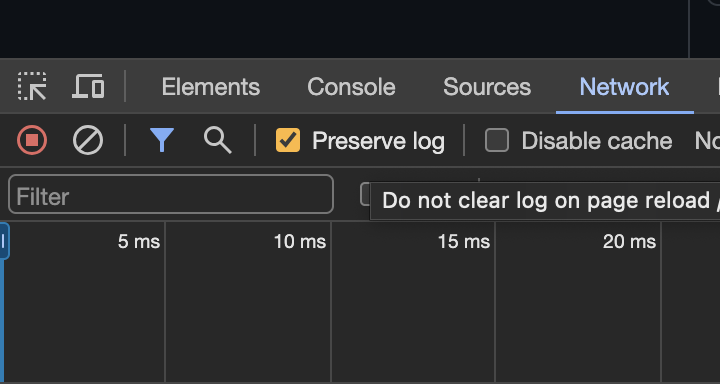
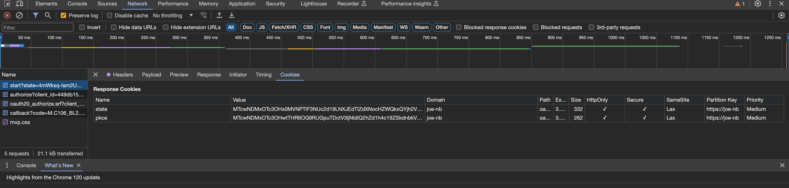
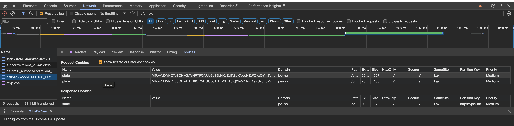

# Debugging Errors

## named cookie not present

Debugging this issue is a bit hard. At least here is a step by step guide to debug the cookie handling on the browser.

I assume, you are using a Chrome-based Browser.

### Requirements

- Before connecting to OpenVPN server, open a browser locally. On the new tab page, do right-click, inspect.
  The browser console appears. Important: click on the Network tab and ensure that "preserve log" is enabled.
  

- Ideally, you aren't logged on Azure with your main browser, otherwise you are not intercept the flow.

- Ensure, you have access to OpenVPN server logs in real-time. Tip: If you are using `journalctl`, use the option `--no-pager`.
  This prevents that large links are truncated.

### Debugging Steps

1. Initiate connection to OpenVPN server, close the browser opened by OpenVPN client.
2. Goto OpenVPN server logs, grab the line with `INFO_PRE,WEB_AUTH` and copy the link with the full state.
3. Paste the link on the tab where the browser console is opened.
4. Continue the auth flow.
5. On the access-denied screen, check the Browser Console for any errors.
6. Then goto the Network tab again. There is a request with `/oauth2/start` or just `start`.
   Click on Cookies and check if the response cookie is present.
   Example Screenshot:
   
7. Then goto the Network tab again. There is a request with `/oauth2/callback` or just `callback`.
   Click on Cookies and check if the request cookie is present.
   Example Screenshot:
   

## Error Message `Received control message: 'PUSH_REQUEST'` in OpenVPN Client v3

Sometimes the client stuck at this stage `Received control message: 'PUSH_REQUEST'` and can't connect, and at the end it will timeout like this message `Connection Timeout`, and you can see in the logs like this:

```ini
⏎[Feb 14, 2024, 22:28:57] Session is ACTIVE
⏎[Feb 14, 2024, 22:28:57] EVENT: GET_CONFIG ⏎[Feb 14, 2024, 22:28:57] Sending PUSH_REQUEST to server...
⏎[Feb 14, 2024, 22:28:58] Sending PUSH_REQUEST to server...
⏎[Feb 14, 2024, 22:29:00] Sending PUSH_REQUEST to server...
⏎[Feb 14, 2024, 22:29:03] Sending PUSH_REQUEST to server...
⏎[Feb 14, 2024, 22:29:06] Sending PUSH_REQUEST to server...
⏎[Feb 14, 2024, 22:29:09] Sending PUSH_REQUEST to server...
⏎[Feb 14, 2024, 22:29:12] Sending PUSH_REQUEST to server...
⏎[Feb 14, 2024, 22:29:15] Sending PUSH_REQUEST to server...
⏎[Feb 14, 2024, 22:29:18] Sending PUSH_REQUEST to server...
⏎[Feb 14, 2024, 22:29:21] Sending PUSH_REQUEST to server...
⏎[Feb 14, 2024, 22:29:24] Sending PUSH_REQUEST to server...
⏎[Feb 14, 2024, 22:29:27] Sending PUSH_REQUEST to server...
⏎[Feb 14, 2024, 22:29:29] Raw stats on disconnect:
 BYTES_IN : 3483
 BYTES_OUT : 4088
 PACKETS_IN : 18
 PACKETS_OUT : 20
```

If you see this message in the Client side (version3), you may want to make sure you added these lines to your oauth configuration file

```ini
CONFIG_OAUTH2_REFRESH_ENABLED=true
CONFIG_OAUTH2_REFRESH_EXPIRES=24h 
CONFIG_OAUTH2_REFRESH_SECRET=xxxxxxxxxxxxxxxx # 16 or 24 charachters
```

For reference you can read more about this properties in the wiki at this [link](https://github.com/jkroepke/openvpn-auth-oauth2/wiki/Configuration#non-interactive-session-refresh)