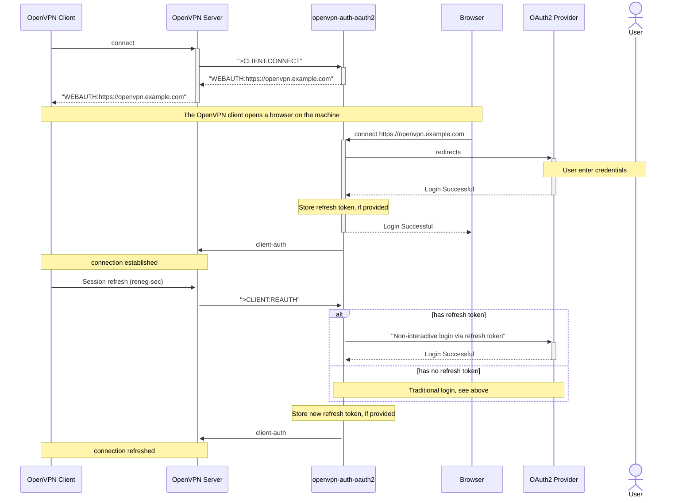

# Home

Welcome to the openvpn-auth-oauth2 wiki!

# OpenVPN version requirements

1. [OpenVPN requirements](OpenVPN)
2. [Installation](Installation)
3. [Configuration](Configuration)
4. [Providers](Providers)
5. [Client token validation](Client%20token%20validation)
6. [FAQ](FAQ)

You can find a demo of the plugin in action [here](Demo)

# Flow

