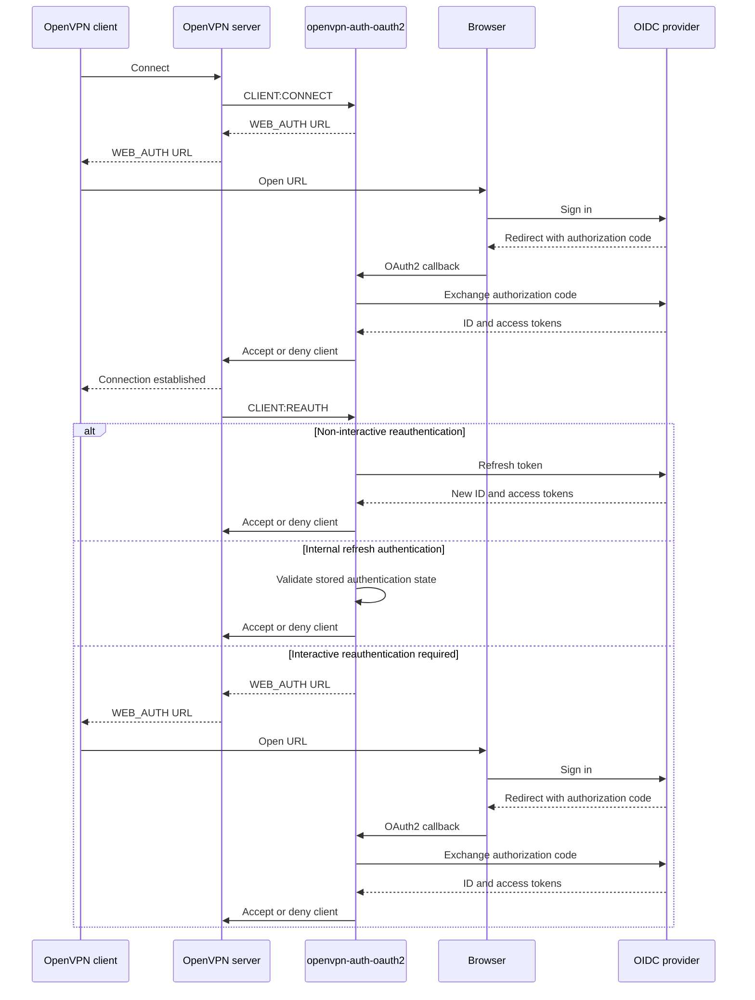

# Home

`openvpn-auth-oauth2` connects OpenVPN Community Server to an OpenID Connect
(OIDC) provider. Users authenticate in their browser, and the result is returned
to OpenVPN through its management interface.

> [!IMPORTANT]
> OpenVPN Access Server is not supported. Before deploying, check the
> [server and client requirements](OpenVPN).

## Start here

Choose the path that matches what you want to do:

| Goal                                     | Start with                                                                                                                       |
|------------------------------------------|----------------------------------------------------------------------------------------------------------------------------------|
| Evaluate the login experience locally    | [Run the Docker Compose demo](Demo)                                                                                              |
| Deploy the service for the first time    | [Getting Started](Getting%20Started)                                                                                             |
| Upgrade an existing version 1 deployment | [Upgrade to version 2](Upgrade%20V2)                                                                                             |
| Fix a connection or login problem        | [Troubleshooting](Debugging%20Errors) and the [FAQ](FAQ)                                                                         |
| Understand the authentication design     | [How OIDC SSO works with OpenVPN](Article%20-%20How%20OIDC%20SSO%20Authentication%20works%20with%20OpenVPN%20Community%20Server) |

## Documentation by task

### Install and configure

- [Installation](Installation) covers Linux packages and building from source.
- [Configuration](Configuration) is the complete settings reference.
- [Providers](Providers) contains registration and configuration examples for
  supported identity providers.
- [HTTPS Listener](HTTPS%20Listener) explains reverse-proxy and native TLS
  options.
- [OpenVPN Plugin](OpenVPN%20Plugin) is a stable Linux AMD64 integration that
  keeps OpenVPN's management interface available for other tools.

### Control access and identity

- [Client token validation](Client%20token%20validation) restricts access with
  token claims and CEL expressions.
- [OpenVPN Username](OpenVPN%20Username) controls how OIDC identities appear in
  OpenVPN.
- [Client-specific configuration](Client%20specific%20configuration) assigns
  routes and other OpenVPN settings to identities.
- [Non-interactive session refresh](Non-interactive%20session%20refresh) reduces
  repeated browser logins.

### Operate and extend

- [Security considerations](Security%20considerations) describes threats and
  recommended mitigations.
- [Filesystem Permissions](Filesystem%20Permissions) covers package and systemd
  file access.
- [Management interface pass-through](Management%20Interface%20pass-through)
  lets another management client connect through `openvpn-auth-oauth2` when
  using the direct integration.
- [Layout Customization](Layout%20Customization) changes the browser result page.

The sidebar contains every documentation page.

## Authentication flow

```mermaid
sequenceDiagram
    participant Client as OpenVPN client
    participant Server as OpenVPN server
    participant Auth as openvpn-auth-oauth2
    participant Browser
    participant IdP as OIDC provider

    Client->>Server: Connect
    Server->>Auth: CLIENT:CONNECT
    Auth-->>Server: WEB_AUTH URL
    Server-->>Client: WEB_AUTH URL
    Client->>Browser: Open URL
    Browser->>IdP: Sign in
    IdP-->>Browser: Redirect with authorization code
    Browser->>Auth: OAuth2 callback
    Auth->>IdP: Exchange authorization code
    IdP-->>Auth: ID and access tokens
    Auth->>Server: Accept or deny client
    Server-->>Client: Connection established

    Server->>Auth: CLIENT:REAUTH
    alt Non-interactive reauthentication
        Auth->>IdP: Refresh token
        IdP-->>Auth: New ID and access tokens
        Auth->>Server: Accept or deny client
    else Internal refresh authentication
        Auth->>Auth: Validate stored authentication state
        Auth->>Server: Accept or deny client
    else Interactive reauthentication required
        Auth-->>Server: WEB_AUTH URL
        Server-->>Client: WEB_AUTH URL
        Client->>Browser: Open URL
        Browser->>IdP: Sign in
        IdP-->>Browser: Redirect with authorization code
        Browser->>Auth: OAuth2 callback
        Auth->>IdP: Exchange authorization code
        IdP-->>Auth: ID and access tokens
        Auth->>Server: Accept or deny client
    end
```
